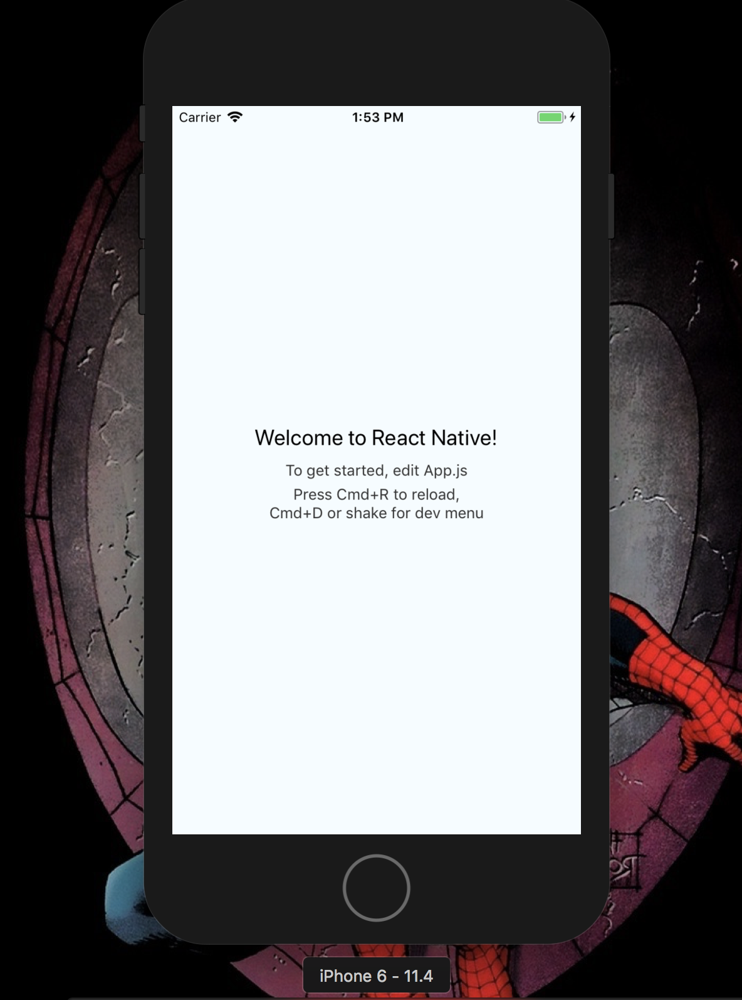

# React Native


### LEARNING OBJECTIVES
*After this lesson, you will be able to:*

- Have a clear understanding of what React Native is
- Understand the benefits of developing in React Native
- How to create a fullstack React Native App

### PRE-WORK
*Before this lesson, you should already be able to:*

- Build React Applications
- Understand how to install applications via NPM
- Understand Component Lifecycle in React
- Can develop a fullstack application 
prior to this course

*If you have never worked with React I suggest learning React and then returning to React Native*

## What is it?

Framework developed by facebook for building mobile apps using Javascript and the React library.

You can view the full documentation here 

[Documentation](https://facebook.github.io/react-native/)

## What makes it cool?

It uses almost all React.js concepts including components,state,props,lifecycles, etc. So if you know Rect you can build in React Native. 

React Native apps are not hybrid apps! This means they do not run on a Webview so they are true native apps. 
It Uses the same fundamental building blocks as a native app built with Swift/Objective-C/Java.

### Advantages
- Cross platform from the start
- Less expensive to develop for than other platforms
- Easier to code then other frameworks
- Faster to develop on due to no compiling
- Open Source and free to use
- Has some premade components for our applications
- Apis for device interaction (vibration/ Push Notifications/ Sharing/ etc)

## Set Up

First off we want to Install the Command line tools for Rect Native through NPM.

```bash
$ npm install -g react-native-cli
```
To help manage the packages we will be installing yarn. 

```bash
$ npm install -g yarn
```
Finally inside our application folder we will be running this comand to create our React application enviroment.

```bash 
$ react-native init myapp
```
*myapp being whatever you want to call your application*

Now navigate inside of your app with..

```bash
$ cd myapp
```
and now we will start the React package manager with

```bash
$ react-native start
```

Now to finally start up our application! 

```bash
$ react-native run-ios
```
*If you are running on pc to view android use run-android instead*

Let your computer get to work and once it renders out you will see inside your xcode preview this..

